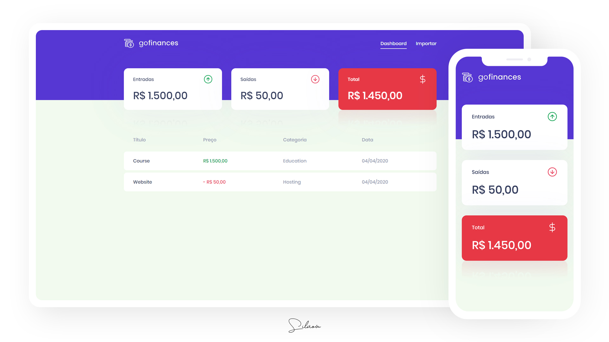
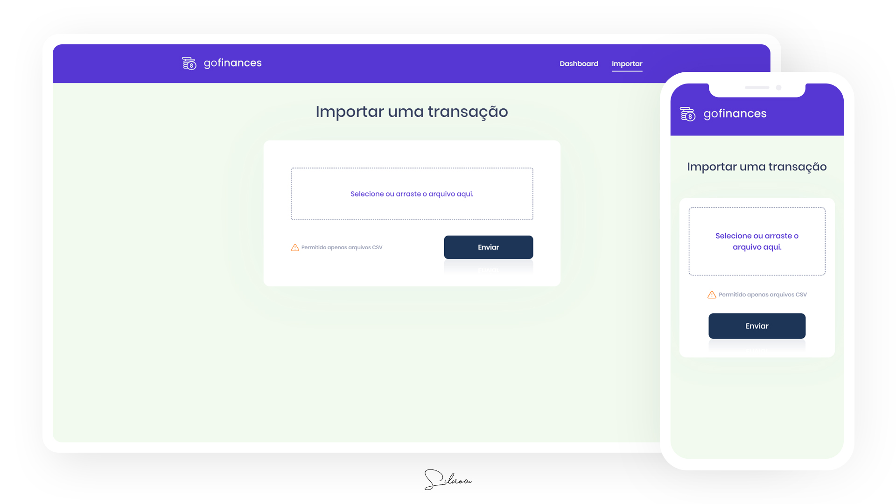

# GoFinances
:dollar: An app to track fictitious financial transactions.

Web application developed for study purposes with Node.js, React.js and TypeScript.

Some technologies and tools used on this project:

- Node.js
- TypeScript
- Express
- TypeORM
- PostgreSQL
- Multer
- CSV Parse
- ESLint
- Prettier
- React.js
- React Dropzone

